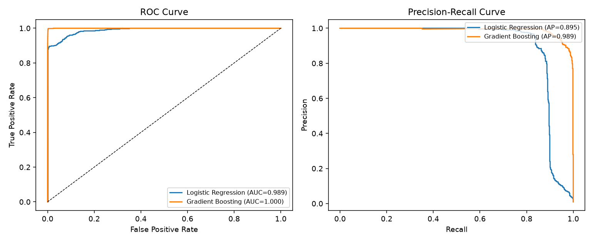

# European Banking Transaction & Fraud Analytics Platform

An end-to-end fraud-analytics platform for a multi-country European retail bank: a Python/SQL data pipeline, behavioural risk-indicator feature engineering, statistical hypothesis testing, unsupervised anomaly detection, a supervised fraud-risk classifier, GDPR-aware pseudonymization, and Power BI dashboards on top.

Built as a portfolio project on realistic **synthetic** data (no real customer or transaction data is used) covering 8 European markets, 18 months of transactions, and four deliberately injected fraud typologies -- card-testing, account takeover, merchant collusion, and mule accounts -- plus the kind of messiness (duplicate rows, mixed date formats, missing values, sign errors) a real core-banking export has, so the cleaning, testing, and detection layers have real work to do.

See [docs/architecture.md](docs/architecture.md) for the full pipeline diagram and design rationale, [docs/gdpr_governance.md](docs/gdpr_governance.md) for the data-protection design, and [docs/sample_insights.md](docs/sample_insights.md) for real generated output.

## Skills demonstrated

`SQL` `Python` `Pandas` `NumPy` `Power BI` `DAX` `Statistics` `Probability` `Hypothesis Testing` `Machine Learning` `Data Cleaning` `Data Modelling` `ETL` `PostgreSQL` `Risk Analytics` `Anomaly Detection` `GDPR` `Data Governance` `Data Privacy` `Git/GitHub`

## What it does

- **Generates** a realistic multi-country transaction stream: 6,000 customers, 450 merchants, ~275k transactions across 8 markets (DE, FR, ES, IT, NL, SE, PL, IE), 2024-2025, with 4 labeled fraud typologies injected into the legitimate stream.
- **Cleans** it with pandas: deduplication, mixed-date-format parsing, sign-error correction, currency-casing normalization, referential-integrity checks -- every fix logged to [outputs/data_quality_report.md](outputs/data_quality_report.md).
- **Engineers risk features**: leakage-safe rolling amount z-score vs. each customer's own history, 1h/24h transaction velocity, geographic distance from home country, new-device and high-risk-channel flags, night-transaction and round-amount indicators.
- **Tests statistically**: five hypothesis tests (Mann-Whitney U, chi-square independence, two-proportion z-test) comparing fraud vs. legitimate behaviour on amount, country, channel, cross-border status, and velocity -- each with an explicit H0/H1 and effect size, not just a p-value.
- **Detects anomalies unsupervised**: per-customer z-score flagging vs. a multivariate Isolation Forest, evaluated against the (held-out) fraud label to show why multivariate detection beats a single threshold.
- **Classifies fraud risk**: Logistic Regression (explainable baseline) vs. Gradient Boosting, trained on a strict time-based split, evaluated on precision/recall/F1/ROC-AUC/PR-AUC -- not accuracy, given the ~0.4% fraud prevalence.
- **Handles data GDPR-aware**: pseudonymizes customer/account IDs (keyed HMAC-SHA256), drops direct identifiers, generalizes age/date fields, and documents lawful basis, retention, access-control roles, and a DPIA summary (see [docs/gdpr_governance.md](docs/gdpr_governance.md)).
- **Visualizes** it in Power BI: a documented star schema, full DAX measure library, and ready-to-import CSV exports built on the pseudonymized layer only (see [powerbi/](powerbi/)).

## Repository structure

```
european-banking-fraud-analytics/
├── python/
│   ├── generate_data.py            # synthetic multi-country transaction generator + fraud injection
│   ├── etl_clean_transform.py      # pandas cleaning: dedupe, dates, sign errors, currency casing
│   ├── feature_engineering.py      # leakage-safe velocity, z-score, geo, device, channel risk features
│   ├── stats_hypothesis_testing.py # Mann-Whitney U, chi-square, two-proportion z-test
│   ├── anomaly_detection.py        # per-customer z-score + Isolation Forest, evaluated vs. labels
│   ├── fraud_model.py              # Logistic Regression vs. Gradient Boosting, time-based split
│   ├── gdpr_pseudonymize.py        # HMAC pseudonymization, data minimization, age/date generalization
│   └── export_for_powerbi.py       # exports the pseudonymized marts to powerbi/exports/
├── sql/
│   ├── schema.sql                  # PostgreSQL DDL: raw (restricted) + analytics (pseudonymized) schemas
│   └── analysis_queries.sql        # geographic/channel/merchant risk queries, risk-decile calibration
├── powerbi/
│   ├── data_model.md               # star schema, relationships, Power Query notes
│   ├── DAX_measures.md             # full DAX measure library
│   └── exports/                    # CSVs ready for Power BI import (pseudonymized layer)
├── docs/
│   ├── architecture.md             # pipeline diagram, design rationale, fraud typologies simulated
│   ├── gdpr_governance.md          # lawful basis, minimization, pseudonymization, access control, DPIA
│   └── sample_insights.md          # real generated output from a full pipeline run
├── outputs/                        # hypothesis-test results, model metrics, charts, data-quality report
└── data/raw/, data/processed/      # generated synthetic source data (gitignored, regenerate locally)
```

## Quickstart

Requires Python 3.11+.

```bash
python -m venv .venv
.venv/Scripts/activate        # Windows; use `source .venv/bin/activate` on macOS/Linux
pip install -r requirements.txt
```

Run the full pipeline end to end (from the repo root):

```bash
python python/generate_data.py
python python/etl_clean_transform.py
python python/feature_engineering.py
python python/stats_hypothesis_testing.py
python python/anomaly_detection.py
python python/fraud_model.py
python python/gdpr_pseudonymize.py
python python/export_for_powerbi.py
```

Then open Power BI Desktop and follow [powerbi/data_model.md](powerbi/data_model.md) to import `powerbi/exports/*.csv` and build the relationships/measures from [powerbi/DAX_measures.md](powerbi/DAX_measures.md).

For a PostgreSQL deployment, run `sql/schema.sql` to create the `raw`/`analytics` schemas and load the corresponding CSVs; `sql/analysis_queries.sql` has ready-to-run analytical queries equivalent to the Python outputs.

## Example output

ROC and Precision-Recall curves comparing the two fraud classifiers on a strict time-based test split (`outputs/fraud_model_curves.png`):



Gradient Boosting reaches 0.90 precision / 0.96 recall at the default 0.5 threshold (ROC-AUC 0.9999) vs. Logistic Regression's 0.36 precision / 0.90 recall (ROC-AUC 0.989) -- see [docs/sample_insights.md](docs/sample_insights.md) for the full metrics table, the hypothesis-test findings, and why the explainable Logistic Regression model is still kept as the production-facing baseline.

## Design notes

- **Why PostgreSQL DDL alongside a local pandas pipeline**: the warehouse is documented as production-ready Postgres schemas (`sql/schema.sql`), split into a restricted `raw` schema and a permission-separated, pseudonymized `analytics` schema -- but the demo runs entirely on local CSVs so anyone cloning the repo can execute the full pipeline with zero infrastructure.
- **Why a time-based train/test split**: a random split would let fraud bursts (e.g. a card-testing episode) leak across train/test, overstating performance. The model is trained on the earliest ~75% of transactions and tested only on the most recent ~25%, matching how it would actually be evaluated in production.
- **Why GDPR pseudonymization runs before the Power BI export, not after**: the BI layer should never have access to more identifying detail than a dashboard needs. The export script only ever reads from the pseudonymized outputs, not the raw processed tables -- so a bug in `export_for_powerbi.py` cannot leak a direct identifier into a shared workspace.
- **Why both an interpretable and a black-box model**: see [docs/architecture.md](docs/architecture.md#why-logistic-regression-and-gradient-boosting-not-just-the-better-model) -- a declined transaction has real consequences for a customer, and that decision needs to be explainable to a regulator or the customer, not just accurate.

## License

MIT -- see [LICENSE](LICENSE).
